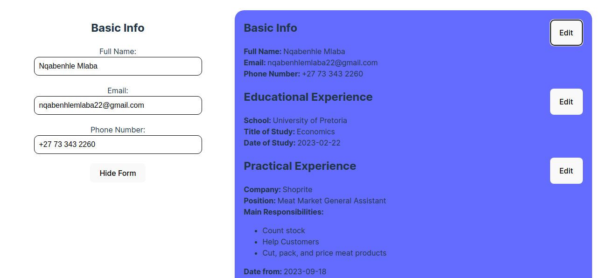

# CV Application

This is a small React CV app that allows users to create their CVs by filling in simple forms. The purpose of this application is to practice using `state` and `props` in React.

Click [here](https://lindelwa122.github.io/odin-CV-application) for a live preview.

## Credits
- [This project](https://www.theodinproject.com/lessons/node-path-react-new-cv-application) is part of [The Odin Project's curriculum](https://www.theodinproject.com).